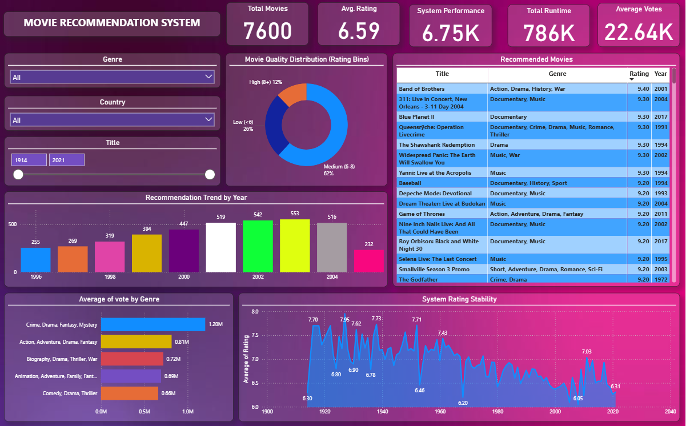

# 🎬 Movie Recommendation System - Power BI

## 📌 Project Overview
This project is a **Movie Recommendation System Dashboard** built using **Power BI**.  
It provides interactive insights on movies, their ratings, genres, votes, and recommendation trends over time.  

The dashboard helps users explore:  
- Movies by **Genre**, **Country**, and **Year**  
- Distribution of **Movie Quality (Rating Bins)**  
- Recommended Movies list with ratings & genres  
- Trends in recommendations across years  
- Voting patterns by genre  
- Stability of system ratings over time  

---

## 📊 Dashboard Preview

---

## 📂 Dataset
- Source: [Kaggle - IMDB Movies Dataset](https://www.kaggle.com/) *(update with your exact dataset link)*  
- Size: ~7600 Movies  
- Attributes: Title, Genre, Rating, Votes, Runtime, Year, Country  

---

## ⚙️ Features of Dashboard
- **Filters/Slicers**: Genre, Country, Year range  
- **KPIs**: Total Movies, Average Rating, System Performance, Total Runtime, Average Votes  
- **Visuals**:
  - Movie Quality Distribution (Pie Chart)  
  - Recommendation Trend by Year (Bar Chart)  
  - Average Votes by Genre (Bar Chart)  
  - System Rating Stability (Line Chart)  
  - Recommended Movies Table  

---

## 🚀 How to Use
1. Clone/download this repository.  
2. Open the `Movie-Recommendation-System.pbix` file in **Power BI Desktop**.  
3. Interact with slicers/filters to explore recommendations.  

---

## 📑 Project Files
- `Movie-Recommendation-System.pbix` → Power BI file  
- `Movie-Recommendation-System.png` → Dashboard Screenshot  
- `presentation.pdf` → (Optional, if available) Project Presentation  
- `README.md` → Project Documentation  

---

## 📌 Future Improvements
- Add **user-based recommendation logic** with ML integration  
- Deploy dashboard on **Power BI Service** for online sharing  
- Include **detailed genre insights** and trending analysis  

---

## 🙌 Acknowledgments
- Dataset: Kaggle (IMDB / Movie Dataset)  
- Tool: Microsoft Power BI  
